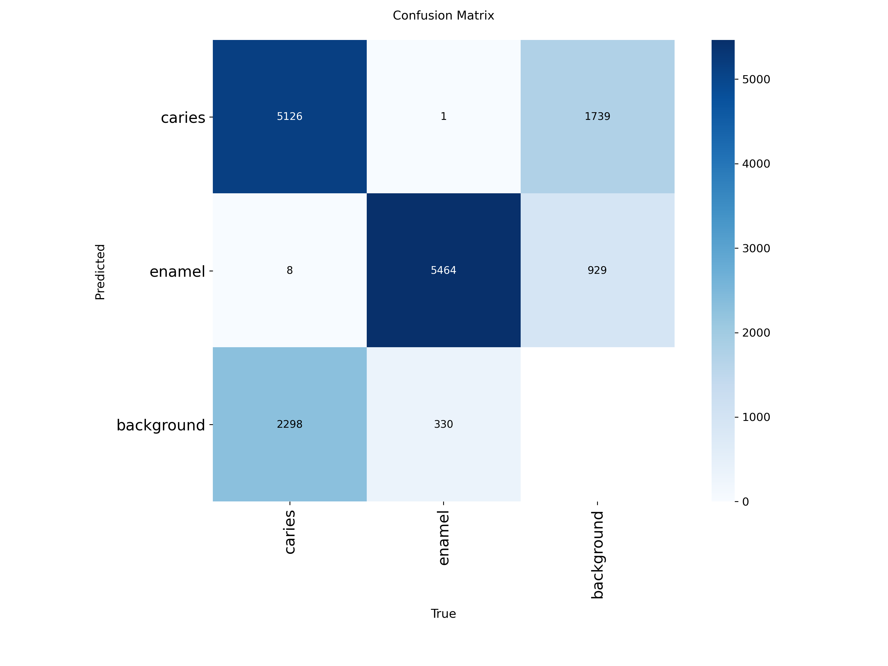
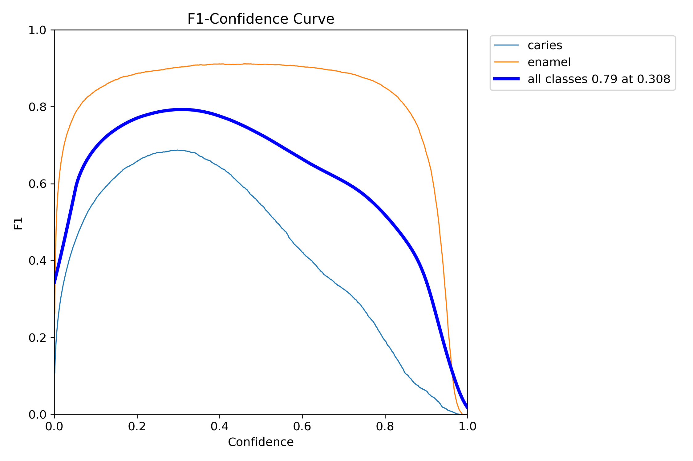
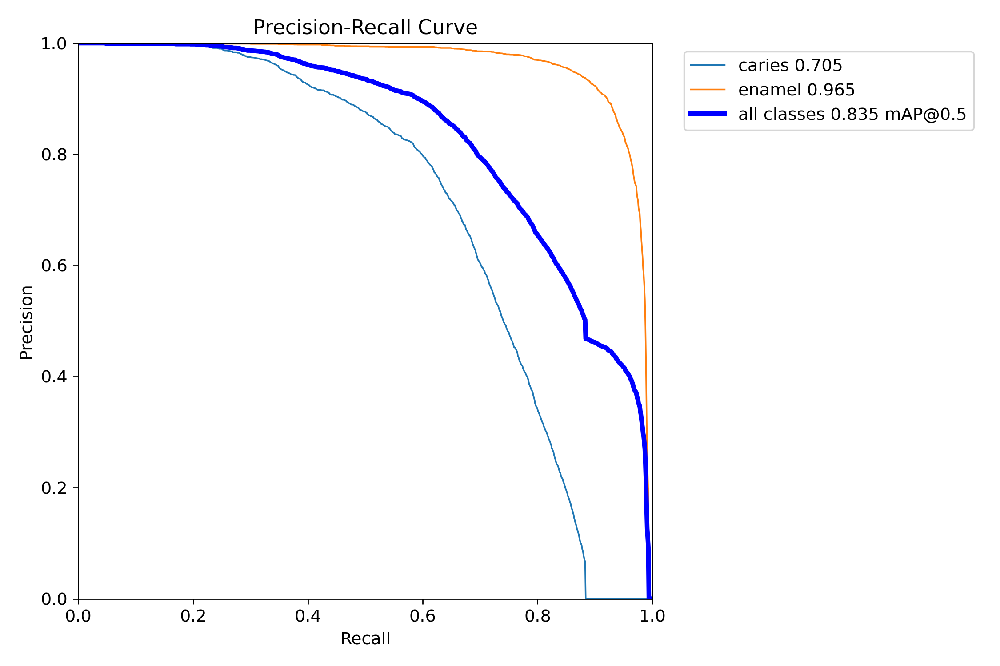
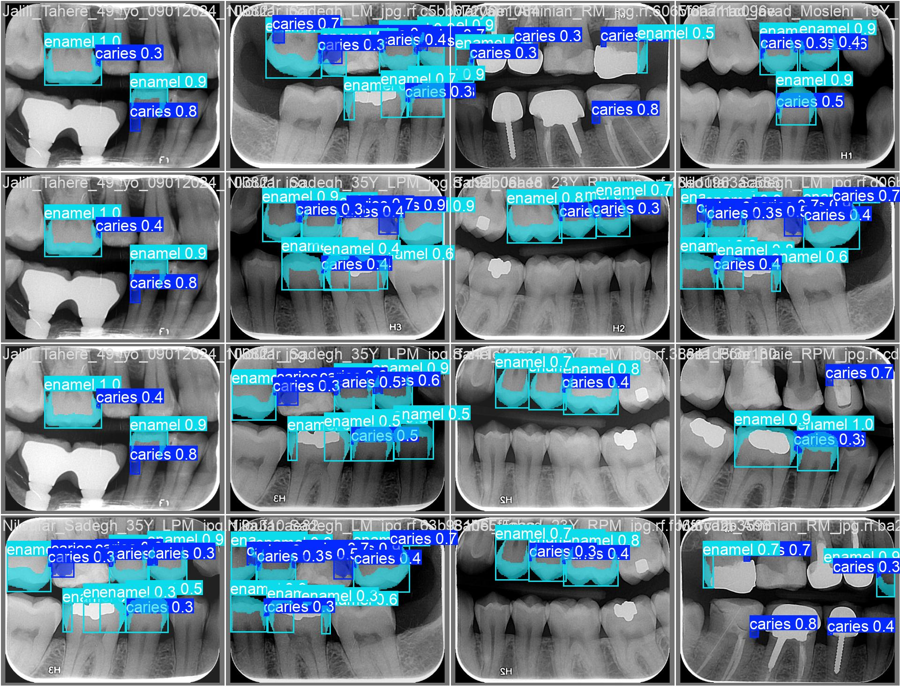

# 🦷 Dental Caries Detection Using YOLOv8n-seg

> Fine-tuned YOLOv8n-seg model for real-time dental caries detection and segmentation on bitewing radiographs — achieving **mAP50 of 0.835** on 1,653 annotated X-ray images.

   

---

## 📋 Table of Contents

- [Project Overview](#project-overview)
- [Clinical Motivation](#clinical-motivation)
- [Dataset](#dataset)
- [Methodology](#methodology)
- [Results](#results)
- [Clinical Interpretation](#clinical-interpretation)
- [Gradio App](#gradio-app)
- [Limitations](#limitations)
- [How to Run](#how-to-run)
- [Project Structure](#project-structure)
- [Comparison to Companion Project](#comparison-to-companion-project)
- [Author](#author)

---

## Project Overview

This project fine-tunes **YOLOv8n-seg** — a lightweight instance segmentation model — to detect and segment dental caries lesions on bitewing and periapical radiographs. The model outputs:

- **Bounding boxes** around detected lesions
- **Segmentation masks** outlining the exact shape of each lesion
- **Confidence scores** for each detection
- **Class labels** — `caries` or `enamel`

The model is packaged with a local **Gradio inference app** (`caries_app.py`) for real-time prediction on new radiographs.

---

## Clinical Motivation

Dental caries is the most prevalent non-communicable disease globally, affecting over 3.5 billion people (WHO, 2023). Early detection significantly improves treatment outcomes — small enamel lesions can be remineralised, while advanced dentinal caries requires invasive restoration.

Current radiographic diagnosis relies on trained dentists manually inspecting bitewing X-rays — a process subject to inter-examiner variability, with reported sensitivity as low as 24% for early interproximal lesions.

An AI-assisted detection tool that localises and segments caries lesions can:
1. Reduce missed diagnoses in high-volume clinical settings
2. Provide objective, reproducible lesion localisation
3. Support dental students and less experienced practitioners
4. Enable longitudinal tracking of lesion progression

---

## Dataset

| Property | Value |
|----------|-------|
| Source | Roboflow Universe (`sina-us3z2/caries-5bj28-r0zdf`) |
| Total images | 1,653 |
| Annotation type | Instance segmentation masks |
| Classes | `caries` (7,432 instances), `enamel` (5,795 instances) |
| Image type | Bitewing and periapical radiographs |
| License | CC BY 4.0 |

### Class Distribution

| Class | Instances |
|-------|-----------|
| Caries | 7,432 |
| Enamel | 5,795 |
| **Total** | **13,227** |

---

## Methodology

### Model Architecture

**YOLOv8n-seg** was selected for the following reasons:

- One-stage detector — simultaneous detection and segmentation in a single forward pass
- Nano variant (`n`) — minimal parameters, suitable for local deployment
- Pre-trained on COCO — strong generalisation from natural image features
- Instance segmentation capability — outputs pixel-level masks, not just bounding boxes
- Established precedent in medical imaging segmentation literature

### Training Configuration

| Parameter | Value |
|-----------|-------|
| Framework | Ultralytics YOLOv8 |
| Base model | YOLOv8n-seg (COCO pretrained) |
| Input size | 640 × 640 px |
| Epochs | 50 |
| Batch size | 16 |
| Hardware | NVIDIA T4 GPU (Google Colab) |
| Dataset format | YOLOv8 segmentation |

### Why Segmentation Over Detection

Standard object detection outputs bounding boxes — rectangular regions around lesions. Instance segmentation outputs pixel-level masks that precisely outline lesion boundaries. For clinical use, mask-level output is more informative:

- Enables lesion area measurement
- Supports longitudinal comparison (is the lesion growing?)
- Provides more precise localisation for treatment planning

---

## Results

### Overall Performance

| Metric | Box | Mask |
|--------|-----|------|
| Precision | 0.831 | 0.804 |
| Recall | 0.771 | 0.743 |
| **mAP50** | **0.835** | **0.807** |
| mAP50-95 | 0.601 | 0.487 |

### Per-Class Performance

| Class | Box mAP50 | Mask mAP50 |
|-------|-----------|------------|
| Caries | 0.705 | 0.652 |
| Enamel | 0.965 | 0.962 |
| **All** | **0.835** | **0.807** |

### Visualisations

**Confusion Matrix**



**F1 Score Curve**



**Precision-Recall Curve**



**Sample Predictions**



---

## Clinical Interpretation

### Why Enamel Outperforms Caries

The model achieves significantly higher mAP50 for enamel (0.965) than caries (0.705). This is clinically expected:

- Enamel is structurally uniform and radiographically consistent — high contrast, predictable appearance
- Caries lesions vary widely in size, shape, depth, and radiographic appearance — early lesions may show subtle radiolucency while advanced lesions are obvious

This performance gap mirrors human inter-examiner variability — dentists also find early caries harder to detect than intact enamel.

### Segmentation Masks

The model produces pixel-level masks that outline lesion boundaries — enabling:
- **Lesion area quantification** in mm² (with calibration)
- **Depth estimation** from mask extent
- **Progression monitoring** across follow-up radiographs

### Appropriate Use

- ✅ Suitable for: lesion localisation and flagging for clinical review
- ✅ Suitable for: dental education and student training tools
- ✅ Suitable for: research applications requiring lesion quantification
- ❌ Not suitable for: standalone diagnosis without clinical examination
- ❌ Not suitable for: treatment planning without dentist oversight

---

## Gradio App

A local inference app is included for real-time caries detection on new radiographs.

### Install dependencies

```bash
pip install ultralytics gradio pillow
```

### Run the app

```bash
python caries_app.py
```

Open the local URL in your browser, upload a dental X-ray, and click **Detect Caries**.

### App Features

- Upload any bitewing or periapical radiograph
- Displays annotated image with bounding boxes and segmentation masks
- Shows detection summary with class labels and confidence scores
- Confidence threshold set at 0.15 for maximum sensitivity

---

## Limitations

**1. Single dataset**
1,653 images from one Roboflow source. Generalisation to images from different X-ray machines, exposure settings, or patient populations is unknown.

**2. No external validation**
The model was trained and validated on data from the same distribution. Real-world clinical performance requires prospective validation on independent datasets.

**3. Caries detection gap**
mAP50 of 0.705 for caries reflects the inherent difficulty of early lesion detection. The model is more reliable for established lesions than early enamel caries.

**4. Image-level only**
The model does not provide tooth-level or surface-level classification (mesial, distal, occlusal) — information that is clinically necessary for charting and treatment planning.

**5. No severity grading**
All caries are treated as a single class regardless of depth (enamel vs dentine vs pulpal involvement).

---

## How to Run

### Requirements

```bash
pip install ultralytics gradio pillow
```

### Run the App

1. Download `best.pt` and `caries_app.py` from this repository
2. Place both files in the same folder
3. Run:

```bash
python caries_app.py
```

4. Open the local URL in your browser
5. Upload a dental X-ray and click **Detect Caries**

> No GPU required. Runs on CPU.

### Environment

| Library | Version |
|---------|---------|
| Python | 3.10 |
| Ultralytics | 8.4+ |
| PyTorch | 2.0+ |
| Gradio | 4.0+ |

---

## Project Structure

```
dental-caries-detection-yolov8/
│
├── yolov8_caries_detection.ipynb   # Training notebook
├── caries_app.py                   # Gradio inference app
├── best.pt                         # Trained model weights
├── README.md                       # This file
└── results/
    ├── confusion_matrix.png
    ├── confusion_matrix_normalized.png
    ├── BoxF1_curve.png
    ├── BoxPR_curve.png
    ├── BoxP_curve.png
    ├── BoxR_curve.png
    ├── MaskF1_curve.png
    ├── MaskPR_curve.png
    ├── MaskP_curve.png
    ├── MaskR_curve.png
    ├── val_batch0_pred.jpg
    ├── val_batch1_pred.jpg
    └── val_batch2_pred.jpg
```

---

## Comparison to Companion Project

This project is the first in a two-part dental AI series:

| Project | Task | Architecture | Key Metric |
|---------|------|-------------|------------|
| **This project** | Lesion detection + segmentation | YOLOv8n-seg | mAP50: 0.835 |
| [EfficientNet Caries Classifier](https://github.com/Sina-Imaginative/dental-caries-classifier) | Binary classification (screening) | EfficientNet-B0 | F1: 0.97 |

Together these demonstrate two complementary AI paradigms — detection for precise lesion localisation and classification for rapid screening triage — applied to the same clinical problem.

---

## Author

**Sina** — Final-year BDS student, Baku, Azerbaijan
Interests: Dental AI, Medical Informatics, Clinical Decision Support

- GitHub: [@Sina-Imaginative](https://github.com/Sina-Imaginative)
- LinkedIn: www.linkedin.com/in/sina-memarzadeh-4980603b8

---

*This project was developed independently.*
